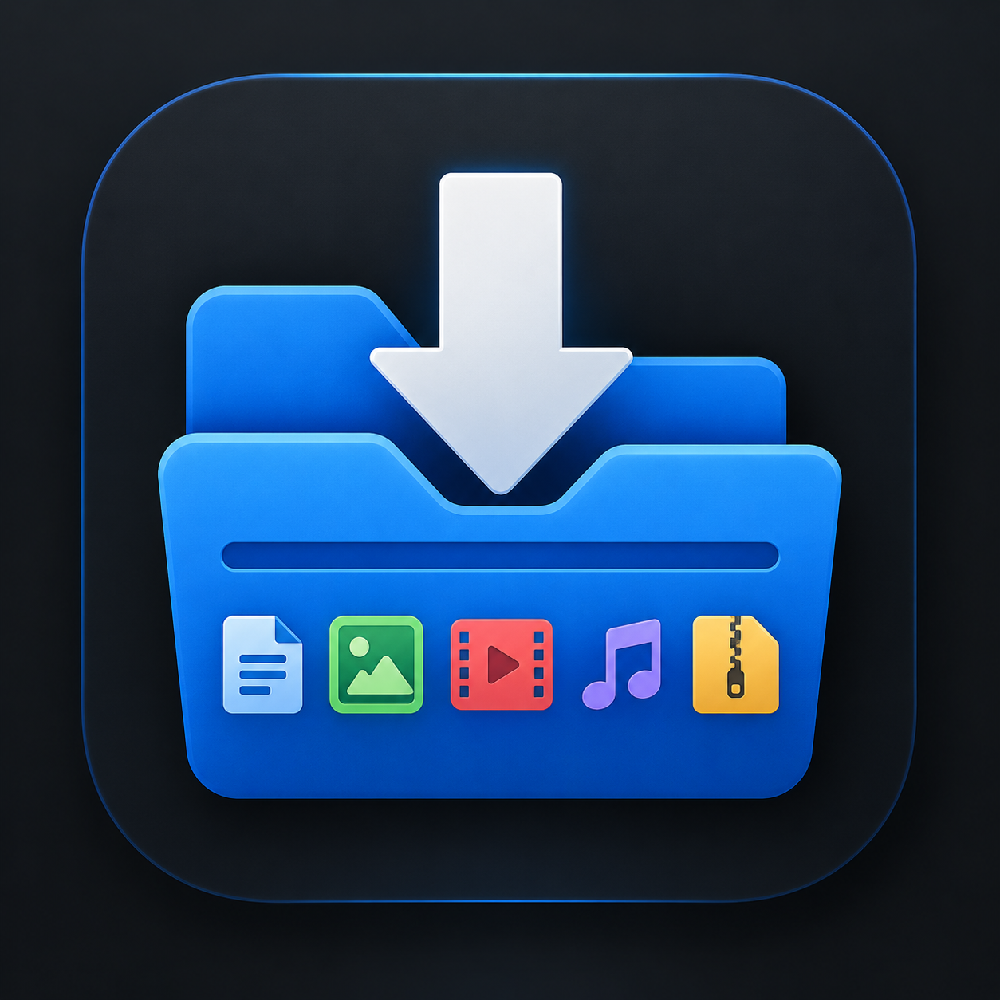

# Download Organizer — Windows



A lightweight Windows utility that automatically organizes files in the user's **Downloads** folder by file type.

The Windows version is written in **C# / .NET 8** and runs silently in the background without a console window.

## Features

- Automatically organizes files in `%USERPROFILE%\Downloads`
- Scans existing files when the organizer starts
- Continues checking for new files in the background
- Waits for files to become available before moving them
- Ignores common browser download/incomplete temporary files
- Detects Windows Explorer's inline filename-rename mode and leaves the file alone until renaming is finished
- Prevents overwriting existing files by adding `_1`, `_2`, etc.
- Runs as a standalone Windows executable
- Does not require the .NET runtime to be installed when using the self-contained release executable

## Categories

| Category | Examples |
|---|---|
| Images | JPG, JPEG, PNG, GIF, WEBP, BMP, SVG, TIFF, HEIC, AVIF, RAW |
| Videos | MP4, MKV, AVI, MOV, WEBM, FLV, WMV, MPEG, TS |
| Audio | MP3, WAV, FLAC, OGG, OPUS, AAC, M4A, WMA |
| Documents | PDF, DOC, DOCX, TXT, ODT, RTF, EPUB |
| Spreadsheets | XLS, XLSX, CSV, ODS, TSV |
| Presentations | PPT, PPTX, ODP |
| Archives | ZIP, RAR, 7Z, TAR, GZ, BZ2, XZ, ZST |
| Installers | EXE, MSI, MSIX, MSIXBUNDLE |
| Disk Images | ISO, IMG, VHD, VHDX |
| Code | PY, PS1, SH, JS, TS, HTML, CSS, C, C++, JAVA, RS, GO, JSON, XML, YAML, SQL |
| Subtitles | SRT, ASS, SSA, VTT, SUB |
| Fonts | TTF, OTF, WOFF, WOFF2 |
| Other | Extensions not covered above |

Files that do not match a category are placed in:

```text
Downloads\Other
```

## Download and run

Download the latest `DownloadOrganizer.exe` from the repository's **Releases** page.

Run the executable.

The organizer works in the background and does not open a command prompt window.

## Start automatically with Windows

The simplest method is to create a shortcut to `DownloadOrganizer.exe` in the Windows Startup folder.

1. Press `Win + R`.
2. Enter:

```text
shell:startup
```

3. Press Enter.
4. Create a shortcut to `DownloadOrganizer.exe` in the folder that opens.

After that, Windows will start Download Organizer automatically when you sign in.

### Disable automatic startup

Open:

```text
shell:startup
```

again and remove the Download Organizer shortcut.

This does **not** delete the executable itself.

## Building from source

### Requirements

- Windows
- .NET 8 SDK

The project uses:

```text
TargetFramework: net8.0-windows
Runtime: win-x64
```

Build:

```powershell
cd "DownloadOrganizerBuild"
dotnet build
```

Create the standalone release executable:

```powershell
dotnet publish -c Release -r win-x64 --self-contained true -p:PublishSingleFile=true -p:IncludeNativeLibrariesForSelfExtract=true
```

The published files are created under:

```text
DownloadOrganizerBuild\bin\Release\net8.0-windows\win-x64\publish\
```

The main release file is:

```text
DownloadOrganizer.exe
```

## Project structure

```text
download-organizer-windows-main/
├── DownloadOrganizer.cs
├── DownloadOrganizer.png
├── DownloadOrganizerBuild/
│   ├── Program.cs
│   └── DownloadOrganizerBuild.csproj
├── download-organizer.ps1
├── start-download-organizer.ps1
├── install-startup.ps1
├── LICENSE
└── README.md
```

The C# project is the current Windows implementation. The PowerShell files are retained as source/history from the earlier implementation.

## How it works

The organizer repeatedly checks the top level of the user's Downloads folder.

For each file it:

1. Ignores browser temporary/incomplete files.
2. Checks whether Windows Explorer is currently editing a filename.
3. Checks whether the file can be opened exclusively.
4. Determines the category from the file extension.
5. Creates the destination category folder if necessary.
6. Moves the file.
7. If a file with the same name already exists, creates a numbered filename such as:

```text
photo.png
photo_1.png
photo_2.png
```

The organizer does not recursively reorganize files already inside category folders.

## License

This project is licensed under the MIT License. See `LICENSE` for details.
